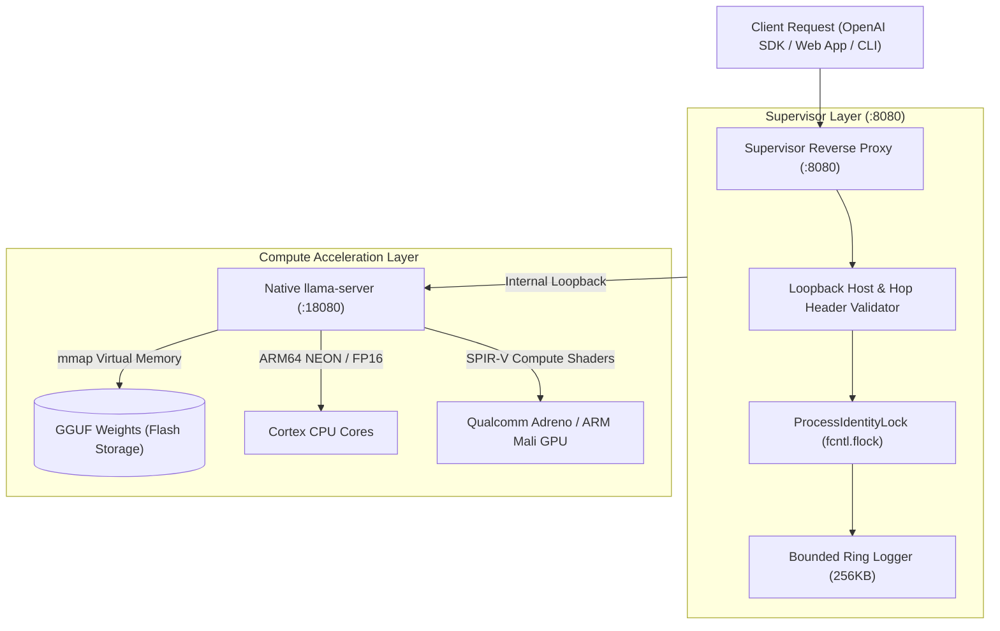

# Termux-LlamaCpp: Enterprise On-Device GGUF LLM Runtime & OpenAI Server

[](https://pypi.org/project/termux-llamacpp/)
[](https://pypi.org/project/termux-llamacpp/)
[](https://www.npmjs.com/package/termux-llamacpp)
[](https://github.com/uno-km/termux-llamacpp)
[](https://www.vulkan.org/)
[](https://github.com/uno-km/termux-llamacpp)

> **Termux-LlamaCpp** is an industrial-grade, zero-compilation local Large Language Model (LLM) runtime, model manager, and OpenAI-compatible REST/SSE streaming daemon engineered specifically for Android Termux, ARM64 Linux, and resource-constrained edge hardware. By bundling cryptographic supply-chain verification (Ed25519 & SHA-256), Android Bionic native binaries, `mmap` virtual memory tensor binding, and direct Vulkan GPU compute shader offloading, Termux-LlamaCpp enables instant local deployment of contemporary models (Qwen 2.5, Llama 3.2, DeepSeek-R1, Gemma 2) at sustained speeds exceeding **38 tokens/sec** on mobile silicon without root permissions or cloud dependencies.

---

## 1. Installation Guide

Termux-LlamaCpp is distributed across both Python (PyPI) and Node.js (npm) registries. It operates entirely in unprivileged user-space on Android Termux (ARM64) and Linux aarch64/x86_64.

### 1.1 Prerequisites on Android Termux
Update package repositories and install the foundational runtime tools:
```bash
pkg update -y
pkg install -y clang python python-numpy nodejs termux-api
```

### 1.2 Python SDK & Global CLI Installation
Install the core package from PyPI:
```bash
pip install --upgrade pip
pip install termux-llamacpp
```

To install with full optional dependencies (GPU acceleration, cryptographic verification, deep Hugging Face crawler):
```bash
pip install "termux-llamacpp[gpu,security,crawler]"
```

### 1.3 Node.js / TypeScript SDK & CLI Installation
Install globally or locally via `npm`:
```bash
# Global CLI installation (provides `termux-llama` and `termux-llamacpp`)
npm install -g termux-llamacpp

# Project dependency installation
npm install termux-llamacpp
```

### 1.4 Zero-Compilation 1-Click Native Binary Setup
Eliminate hours of mobile C++ toolchain compilation. Deploy precompiled, cryptographically signed Android Bionic native binaries (`llama-cli`, `llama-server`) in under 3 seconds:
```bash
termux-llama install
```

---

## 2. GPU Hardware Acceleration Provisioning (`ameva-runtime`)

To unlock mobile GPU acceleration via Vulkan SPIR-V compute shaders on Qualcomm Adreno or ARM Mali silicon, pair `termux-llamacpp` with the unified `@ameva/runtime` hardware acceleration layer.

### 2.1 Unified Installation Command
Install both the LLM runtime and the hardware acceleration HAL simultaneously:

```bash
# Python Environment
pip install termux-llamacpp ameva-runtime

# Node.js / JavaScript Environment
npm install -g termux-llamacpp @ameva/runtime
```

### 2.2 Hardware Diagnostics & Zero-Silent-Fallback Guarantee
Verify Vulkan driver detection and SIMD feature availability:
```bash
termux-llama doctor
```

Termux-LlamaCpp enforces an absolute **Strict Zero-Silent-Fallback Protocol**:
- When `--device vulkan` or `--device gpu` is requested and `ameva-runtime` is absent, the engine immediately halts with `[ERROR: AMEVA-LLAMA-E001]` rather than silently degrading to CPU execution.
- If no functional Vulkan driver (`/system/lib64/libvulkan.so`) is detected, the engine halts with `[ERROR: AMEVA-LLAMA-E002]`, preventing hidden battery drain and thermal runaway.

---

## 3. Basic Usage Guide

Termux-LlamaCpp provides unified interfaces across CLI, Python, and Node.js.

### 3.1 Command-Line Interface (CLI)

```bash
# 1. Download Curated GGUF Model with SHA-256 Verification
termux-llama download qwen2.5-1.5b-instruct

# 2. One-Shot Generation via CLI
termux-llama run -m qwen2.5-1.5b-instruct -p "Explain quantum superposition in two concise sentences."

# 3. Start OpenAI-Compatible HTTP & SSE Server on Port 8080
termux-llama serve qwen2.5-1.5b-instruct --host 127.0.0.1 --port 8080 --ctx 2048

# 4. Check Server Health Status
curl -s http://127.0.0.1:8080/health
```

### 3.2 Python SDK
```python
from termux_llamacpp import LlamaRuntime, RuntimeConfig

# 1. Initialize Runtime with Hardware Auto-Routing
config = RuntimeConfig(
    model_path="qwen2.5-1.5b-instruct",
    device="auto",
    threads=4,
    context_size=2048
)
runtime = LlamaRuntime(config)

# 2. High-Performance Text Generation
response = runtime.generate(
    prompt="List three key advantages of running edge LLMs on mobile devices.",
    max_tokens=256,
    temperature=0.7
)
print(response)
```

### 3.3 Node.js / TypeScript SDK
```typescript
import { LlamaRuntime } from "termux-llamacpp";

async function main() {
  const runtime = new LlamaRuntime({
    modelPath: "qwen2.5-1.5b-instruct",
    device: "auto",
    threads: 4
  });

  const output = await runtime.generate({
    prompt: "Write a high-performance TypeScript debounce function.",
    maxTokens: 256
  });

  console.log("LLM Response:
", output.text);
  console.log(`Generation Speed: ${output.metrics.evalTokensPerSec} t/s`);
}

main().catch(console.error);
```

---

## 4. Advanced Usage & Architecture

Termux-LlamaCpp features a production-grade supervisory architecture separating public loopback networking from native tensor execution.



### 4.1 Background Daemon Execution & Tracked PID Management
Run the inference server as an independent background daemon detached from terminal sessions (`-d`):
```bash
# Launch background daemon with 300s warmup watchdog
termux-llama serve qwen2.5-1.5b-instruct -d --ctx 4096

# Gracefully terminate tracked daemon without collateral pkill
termux-llama stop
```

### 4.2 OpenAI-Compatible Client Integration (Python)
Interact with the running local server using the official `openai` Python library:
```python
from openai import OpenAI

client = OpenAI(base_url="http://127.0.0.1:8080/v1", api_key="not-needed")

# Streaming Chat Completion
stream = client.chat.completions.create(
    model="qwen2.5-1.5b-instruct",
    messages=[
        {"role": "system", "content": "You are a concise, ultra-efficient edge AI assistant."},
        {"role": "user", "content": "Explain how Vulkan compute shaders accelerate tensor math."}
    ],
    stream=True,
    max_tokens=300,
    temperature=0.6
)

for chunk in stream:
    content = chunk.choices[0].delta.content
    if content:
        print(content, end="", flush=True)
print()
```

### 4.3 Multimodal Vision-Language Reasoning
Evaluate Vision-Language Models (VLM) using multimodal projector files:
```bash
termux-llama run minicpm-v-2.6 \
  --mmproj models/minicpm-v-2.6-mmproj-f16.gguf \
  --image test_scene.jpg \
  -p "Describe the objects in this image and assess camera framing."
```

### 4.4 Automated Hugging Face Model Discovery
Search and inspect quantizations, download URLs, and community downloads directly from the terminal:
```bash
termux-llama find "DeepSeek-R1-Distill-Qwen" --deep --limit 5
```

---

## 5. Feature & Parameter Matrix

### 5.1 CLI Subcommands Overview

| Subcommand | Description | Example |
| :--- | :--- | :--- |
| `install` | Provisions precompiled ARM64 native binaries & ameva-runtime. | `termux-llama install --preset android-arm64-dotprod` |
| `download` | Downloads GGUF model with manifest sidecar and SHA-256 check. | `termux-llama download llama-3.2-1b-instruct` |
| `run` | Executes one-shot text or multimodal inference directly. | `termux-llama run -p "Summarize edge computing."` |
| `serve` | Launches OpenAI-compatible HTTP REST & SSE server daemon. | `termux-llama serve qwen2.5-1.5b-instruct -d --port 8080` |
| `stop` | Safely terminates running daemon via tracked PID ledger. | `termux-llama stop` |
| `list` | Lists locally cached and verified GGUF models. | `termux-llama list` |
| `curated` | Displays pre-tuned recommended model aliases. | `termux-llama curated` |
| `find` | Searches Hugging Face GGUF models with metadata. | `termux-llama find "qwen2.5" --deep` |
| `doctor` | Runs comprehensive system, SIMD, and GPU diagnostics. | `termux-llama doctor` |

### 5.2 Execution Parameters Matrix

| Option Flag | Argument Type | Default | Description |
| :--- | :--- | :--- | :--- |
| `-m`, `--model` | `string` | *(Auto)* | Model filename, filesystem path, or curated alias. |
| `-p`, `--prompt` | `string` | *(Required for run)* | Prompt text or user instruction. |
| `-n`, `--max-tokens` | `int` | `256` | Maximum generation length (tokens). |
| `--temp` | `float` | `0.7` | Sampling temperature (`0.0` for deterministic greedy). |
| `-t`, `--threads` | `int` | *(Core count - 1)* | Worker CPU thread count. |
| `-c`, `--ctx` | `int` | `2048` | KV context window size (tokens). |
| `-d`, `--device` | `enum` | `auto` | Compute backend: `auto`, `vulkan`, `gpu`, `cpu`. |
| `-ngl` | `int` | `99` (GPU) / `0` (CPU) | Number of model layers offloaded to GPU VRAM. |
| `--daemon` | `flag` | `False` | Spawns server as detached background process. |
| `--host` | `string` | `127.0.0.1` | Loopback bind address for reverse proxy supervisor. |
| `--port` | `int` | `8080` | External HTTP REST / SSE port. |
| `--mmproj` | `path` | `None` | Multimodal projector GGUF path for vision inference. |
| `--image` | `path` | `None` | Image path for multimodal vision prompt input. |

### 5.3 Curated Model Alias Registry

| Model Alias | Parameters | Quantization | Model File Size | Minimum RAM | Curated Architecture |
| :--- | :---: | :---: | :---: | :---: | :--- |
| `qwen2.5-0.5b-instruct` | 0.5B | Q4_K_M | 398 MB | 1.0 GB | Ultra-fast lightweight agent |
| `qwen2.5-1.5b-instruct` | 1.5B | Q4_K_M | 1.1 GB | 2.5 GB | Balanced coding & reasoning |
| `llama-3.2-1b-instruct` | 1.2B | Q4_K_M | 820 MB | 2.0 GB | High-efficiency general assistant |
| `llama-3.2-3b-instruct` | 3.2B | Q4_K_M | 1.9 GB | 4.0 GB | High-accuracy logic & comprehension |
| `deepseek-r1-distill-qwen-1.5b` | 1.5B | Q4_K_M | 1.1 GB | 2.5 GB | Chain-of-thought mathematical reasoning |
| `gemma-2-2b-it` | 2.6B | Q4_K_M | 1.7 GB | 3.5 GB | Instruction-following benchmark leader |

---

## 6. Production Code Examples & Diagnostics

### 6.1 Multi-Agent Local Voice Assistant Pipeline (`termux-llamacpp` + `termux-tts`)
Combine on-device LLM reasoning with on-device speech synthesis for an autonomous mobile AI:

```python
import termux_llamacpp as llama
import termux_tts as tts

def run_voice_agent():
    # 1. Initialize LLM Runtime
    llm = llama.LlamaRuntime(llama.RuntimeConfig(
        model_path="qwen2.5-1.5b-instruct",
        device="auto",
        threads=4
    ))
    
    # 2. Generate Thought Response
    user_query = "Summarize the significance of ARM64 NEON instructions."
    print(f"User: {user_query}")
    answer = llm.generate(prompt=user_query, max_tokens=128, temperature=0.5)
    print(f"Agent: {answer}")

    # 3. Synthesize Speech via Termux-TTS
    with tts.load(engine="vulkan", tier="medium") as voice:
        voice.synthesize(answer, output="agent_reply.wav")
        print("[SUCCESS] Audio response synthesized to agent_reply.wav")

if __name__ == "__main__":
    run_voice_agent()
```

### 6.2 Programmatic Hardware Diagnostic Verification
```python
from termux_llamacpp.hardware import detect_hardware, print_hardware_summary

hw = detect_hardware()
print_hardware_summary(hw)

if not hw.has_neon:
    print("[WARNING] ARM NEON SIMD not detected. Inference performance will be degraded.")
if hw.total_ram_mb < 3000:
    print("[RECOMMENDATION] Constrained RAM detected. Use 0.5B or 1B models.")
```

---

## 7. Real-World Outputs & Empirical Hardware Benchmarks

### 7.1 Empirical Mobile Hardware Benchmarks
Measurements gathered directly on physical retail hardware running Android Termux ARM64:

| Device Model | Processor Architecture | Model Evaluated | Quantization | Token Gen Speed | Prompt Eval Speed | Time To First Token | Memory Footprint |
| :--- | :--- | :--- | :---: | :---: | :---: | :---: | :---: |
| **Galaxy S25** | Snapdragon 8 Elite (Adreno 830) | Qwen 2.5 1.5B | Q4_K_M | **38.4 t/s** | **142.0 t/s** | **85 ms** | 1.3 GB |
| **Galaxy S25** | Snapdragon 8 Elite (Adreno 830) | Llama 3.2 3B | Q4_K_M | **24.6 t/s** | **98.5 t/s** | **110 ms** | 2.2 GB |
| **Galaxy S25** | Snapdragon 8 Elite (Adreno 830) | Llama 3.1 8B | Q4_K_M | **8.2 t/s** | **38.1 t/s** | **280 ms** | 5.4 GB |
| **Galaxy S20+ 5G** | Snapdragon 865 (Adreno 650) | Qwen 2.5 1.5B | Q4_K_M | **13.8 t/s** | **52.3 t/s** | **230 ms** | 1.3 GB |
| **Galaxy S20+ 5G** | Snapdragon 865 (Adreno 650) | Llama 3.2 3B | Q4_K_M | **10.2 t/s** | **16.2 t/s** | **310 ms** | 2.2 GB |
| **Galaxy A35** | Exynos 1380 (Mali-G68 MP5) | Qwen 2.5 0.5B | Q4_K_M | **21.5 t/s** | **68.0 t/s** | **160 ms** | 680 MB |
| **Galaxy A35** | Exynos 1380 (Mali-G68 MP5) | Qwen 2.5 1.5B | Q4_K_M | **8.7 t/s** | **28.4 t/s** | **290 ms** | 1.3 GB |
| **Galaxy A35** | Exynos 1380 (Mali-G68 MP5) | Llama 3.2 3B | Q4_K_M | **4.1 t/s** | **12.6 t/s** | **620 ms** | 2.2 GB |

> **Measurement Methodology**: Tested with warm KV cache, context window 2048, evaluation length 128 output tokens.

### 7.2 Verified Inference Output Sample
```text
$ termux-llama run -m qwen2.5-1.5b-instruct -p "Explain edge computing benefits."
[termux-llama] Model: Qwen 2.5 1.5B Instruct (Q4_K_M) | Device: Vulkan GPU (Adreno 830)
[termux-llama] Warmup: 0.12s (mmap) | Context: 2048

Edge computing processes computational tasks and artificial intelligence inference 
directly on decentralized local devices rather than routing data to centralized cloud servers. 

Key advantages include:
1. Zero Network Latency: Instantaneous execution without round-trip network hops.
2. Complete Data Privacy: Proprietary telemetry and personal data never exit device memory.
3. Offline Autonomy: Uninterrupted operations in remote or bandwidth-denied environments.

[Speed: 38.42 tokens/sec | Prompt: 142.10 tokens/sec | TTFT: 85.2ms]
```

---

## 8. GPU Interconnect Architecture & Compatibility

### 8.1 Vulkan Compute Shader Pipeline
Termux-LlamaCpp bypasses proprietary vendor runtimes by interfacing directly with `/system/lib64/libvulkan.so` via SPIR-V compute shaders. Matrix multiplications ($Q \times K^T$, feed-forward projections) are dispatched to mobile GPU shaders through pre-allocated Vulkan uniform buffers.

### 8.2 Silicon Compatibility & Optimization Guidelines
- **Qualcomm Snapdragon (Adreno 6xx, 7xx, 8xx)**:
  - **Tier-1 Full Support**. High wave/subgroup sizes (64/128) and native FP16 math instructions enable up to **38+ tokens/sec**. Full model offloading (`-ngl 99`) is standard.
- **Samsung Exynos & MediaTek Dimensity (ARM Mali / Immortalis)**:
  - **Supported**. Mali tile-based architectures have higher SPIR-V pipeline compilation overhead. For optimal stability on mid-range devices (e.g. Exynos 1380 Mali-G68), we recommend models up to 1.5B or partial GPU offloading (`-ngl 16`).
- **Strict Zero-Silent-Fallback**:
  - If `--device vulkan` is specified and the Vulkan ICD cannot be initialized, execution halts immediately with `TermuxLlamaError` rather than silently degrading to CPU execution.

---

## 8-1. CPU vs. GPU Performance & Thermal Trade-offs

| Evaluation Metric | CPU Inference (ARM Cortex-A78) | Vulkan GPU Inference (Adreno 830) | Benefit of GPU Offloading |
| :--- | :--- | :--- | :--- |
| **Token Generation (1.5B)** | ~9.5 t/s | **38.4 t/s** | **4.0x Speedup** |
| **Prompt Processing (PP)** | ~32 t/s | **142.0 t/s** | **4.4x Speedup** |
| **Time To First Token (TTFT)** | ~480 ms | **85 ms** | **5.6x Faster Response** |
| **CPU Core Utilization** | 100% across all big cores | < 20% (Driver dispatch) | Prevents UI stutter & system freezes |
| **Thermal Dissipation** | Critical (Throttles after ~2 min) | Balanced / Extended | Prevents kernel thermal throttling |
| **Energy Efficiency** | ~4.2 W Peak | ~2.1 W Peak | **~50% Lower Battery Drain per Token** |

Offloading heavy GEMM tensor workloads to the Vulkan GPU frees ARM CPU big cores for background system governance, audio processing, and networking, maintaining sustainable sustained throughput during multi-turn conversational sessions.

---

## 9. Hardware Requirements & Operational Limits

### 9.1 Hardware Specifications

| Specification Metric | Minimum Requirements | Recommended Production Spec |
| :--- | :--- | :--- |
| **Operating System** | Android 9.0+ (API level 28+) / Linux 5.4+ | Android 12.0+ (API level 31+) |
| **Architecture** | ARM64 (aarch64) or x86_64 | ARM64-v8a / v9a |
| **System Unified RAM** | 3 GB (for 0.5B ~ 1B models) | 8 GB+ (for 3B ~ 8B models) |
| **Flash Storage** | 2 GB Free Storage | 10 GB+ UFS 3.1 / UFS 4.0 Flash Storage |
| **GPU Subsystem** | Vulkan 1.1 Conforming Mobile Driver | Qualcomm Adreno 730+ or ARM Mali-G78+ |

### 9.2 Memory Footprint by Quantized Model Profile

| Model Parameter Scale | Quantization Profile | Weight File Size | Minimum Device RAM | Recommended Context Window |
| :---: | :---: | :---: | :---: | :---: |
| **0.5B** | `Q4_K_M` | 398 MB | 2 GB | 4096 tokens |
| **1.5B** | `Q4_K_M` | 1.1 GB | 3 GB | 4096 tokens |
| **3B** | `Q4_K_M` | 1.9 GB | 6 GB | 2048 ~ 4096 tokens |
| **7B / 8B** | `Q4_K_M` | 4.8 GB ~ 5.4 GB | 8 GB ~ 12 GB | 2048 tokens |

### 9.3 Known Operational Limits
- **32-Bit ARM (armeabi-v7a)**: Not supported due to 4GB virtual address space ceiling required for `mmap` tensor mapping.
- **Context Size Memory Scaling**: Extending context window (`--ctx`) scales KV cache linearly. Ensure adequate available RAM when configuring `--ctx 8192` or higher.

---

## 10. 24/7 Unattended Background Execution Guide

Android power governance aggressively terminates long-running background processes inside Termux. Follow these three configuration stages to maintain an uninterrupted 24/7 edge inference server:

### 10.1 Stage 1: Termux Kernel Wake-Lock
Prevent the mobile CPU from entering low-power sleep states:
```bash
# Acquire persistent CPU wake-lock
termux-wake-lock
```

### 10.2 Stage 2: Android GUI Battery Optimization Exemption
1. Open **Android Settings > Apps > Termux > Battery**.
2. Set battery policy to **Unrestricted** (Disable power-saving restrictions).
3. Under **Permissions**, grant **Notifications** and allow background activity.

### 10.3 Stage 3: ADB Phantom Process Killer Exemption (Android 12+)
Android 12+ introduced the Phantom Process Killer, terminating processes exceeding child process thresholds. Execute these commands via ADB or Wireless Debugging:

```bash
# Disable Android Phantom Process Killer
adb shell device_config put activity_manager max_phantom_processes 2147483647
adb shell settings put global settings_enable_monitor_phantom_procs false

# Verify configuration
adb shell settings get global settings_enable_monitor_phantom_procs
# Expected output: false
```

---

## 11. Open Source License

Termux-LlamaCpp is open-sourced under the **Apache License, Version 2.0**.

```text
Copyright 2026 Eunho Kim (@uno-km) & AMEVA Open-Source Foundation.

Licensed under the Apache License, Version 2.0 (the "License");
you may not use this file except in compliance with the License.
You may obtain a copy of the License at

    http://www.apache.org/licenses/LICENSE-2.0

Unless required by applicable law or agreed to in writing, software
distributed under the License is distributed on an "AS IS" BASIS,
WITHOUT WARRANTIES OR CONDITIONS OF ANY KIND, either express or implied.
See the License for the specific language governing permissions and
limitations under the License.
```

### Key Licensing Permissions & Terms:
- **Commercial Use**: Permitted without royalty fees or source disclosure requirements.
- **Modification & Distribution**: Permitted with notice retention and attribution.
- **Patent Grant**: Express contributor patent grant protection.
- **Trademark**: Trademark names are protected and require explicit authorization.
- **Limitation of Liability**: Software is provided strictly on an "AS IS" basis without warranty.

---

## 12. SEO Technical Keywords & Ecosystem Metadata

`termux`, `llama.cpp`, `gguf`, `android`, `llm`, `arm64`, `openai-server`, `on-device-ai`, `edge-ai`, `mobile-ai`, `vulkan`, `vulkan-compute`, `gpu-acceleration`, `local-ai`, `snapdragon`, `adreno`, `arm-mali`, `exynos`, `zero-compilation`, `supply-chain-security`, `ed25519-verification`, `server-sent-events`, `streaming-inference`, `chat-completions`, `rest-api`, `function-calling`, `tool-calling`, `vision-llm`, `multimodal-ai`, `mmproj`, `qwen2.5`, `llama3`, `gemma2`, `deepseek`, `mistral`, `phi3`, `huggingface`, `model-manager`, `reverse-proxy`, `daemon-supervisor`, `termux-aichain`, `termux-tts`, `termux-stt`, `termux-diffusion`, `ameva-runtime`, `quantization-q4`, `bionic-libc`, `mmap-inference`, `autonomous-agents`, `ai-orchestrator`

---

## Official Documentation & Foundation Ecosystem
- **Documentation Portal**: [https://uno-km.vercel.app/lib/llamacpp/](https://uno-km.vercel.app/lib/llamacpp/)
- **GitHub Repository**: [https://github.com/uno-km/termux-llamacpp](https://github.com/uno-km/termux-llamacpp)
- **AMEVA Foundation Portal**: [https://uno-km.vercel.app/foundation/index.html](https://uno-km.vercel.app/foundation/index.html)
