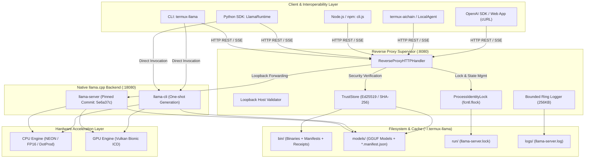

# termux-llamacpp 시스템 아키텍처 및 전 소스 코드 엔지니어링 마스터 가이드

본 문서는 Android Termux 및 ARM64 모바일 환경 전용 경량 로컬 LLM 런타임 및 공급망 검증 기반 모델 매니저인 `termux-llamacpp`의 설치, 전체 기능 동작 원리, 모든 모듈의 소스 코드 구조, 실행 라이프사이클 및 검증 지표를 총망라한 엔지니어링 마스터 기술 문서입니다.

---

## 목차 (Table of Contents)

1. [시스템 개요 및 아키텍처 (System Architecture)](#1-시스템-개요-및-아키텍처-system-architecture)
2. [설치 파이프라인 및 환경 구성 (`scripts/install.sh`)](#2-설치-파이프라인-및-환경-구성-scriptsinstallsh)
3. [모듈별 상세 소스 코드 및 동작 원리 (Module Breakdown)](#3-모듈별-상세-소스-코드-및-동작-원리-module-breakdown)
   - 3.1 [`termux_llamacpp/config.py`](#31-설정-및-ssot-정의-termux_llamacppconfigpy)
   - 3.2 [`termux_llamacpp/hardware.py`](#32-하드웨어-탐지-및-가속-매핑-termux_llamacpphardwarepy)
   - 3.3 [`termux_llamacpp/security.py`](#33-암호화-공급망-보안-및-무결성-termux_llamacppsecuritypy)
   - 3.4 [`termux_llamacpp/downloader.py`](#34-모델-다운로더-및-캐시-매니저-termux_llamacppdownloaderpy)
   - 3.5 [`termux_llamacpp/engine.py`](#35-런타임-엔진-및-디바이스-라우팅-termux_llamacppenginepy)
   - 3.6 [`termux_llamacpp/server.py`](#36-리버스-프록시-수퍼바이저-및-서버-매니저-termux_llamacppserverpy)
   - 3.7 [`termux_llamacpp/crawler.py`](#37-hugging-face-탐색-및-크롤러-termux_llamacppcrawlerpy)
   - 3.8 [`termux_llamacpp/cli.py` & `__main__.py`](#38-cli-인터페이스-termux_llamacppclipy--__main__py)
   - 3.9 [Node.js / TypeScript 바인딩 (`bin/cli.js` & `js/src/`)](#39-nodejs--typescript-바인딩-binclijs--jssrc)
4. [실행 흐름별 엔드투엔드 라이프사이클 (Execution Lifecycles)](#4-실행-흐름별-엔드투엔드-라이프사이클-execution-lifecycles)
5. [실기기 벤치마크 및 검증 결과 (Empirical Verification)](#5-실기기-벤치마크-및-검증-결과-empirical-verification)

---

## 1. 시스템 개요 및 아키텍처 (System Architecture)

### 1.1 프로젝트 정의 및 핵심 설계 목표
`termux-llamacpp`는 모바일 디바이스(Android Termux ARM64)의 제약된 컴퓨팅 자원 및 불안정한 네트워크 환경을 극복하기 위해 설계된 **Zero-Compilation 로컬 GGUF 런타임 및 OpenAI 호환 API 수퍼바이저(Supervisor)**입니다.

- **Zero-Compilation 즉시 실행**: 수 GB 크기의 컴파일러 툴체인(`clang`, `cmake`, `ninja`) 설치 및 수십 분에 달하는 모바일 현장 빌드 과정을 생략하고, 사전 검증된 Android Bionic 네이티브 바이너리(`llama-cli`, `llama-server`)를 즉시 배포합니다.
- **공급망 보안 (Supply-Chain Security)**: Ed25519 암호화 전자서명 검증, SHA-256 해시 검증, Pinned Commit 무결성 검증, 심볼릭 링크 공격 방지, 아토믹 파일 교체(`atomic_replace_verified`)를 통해 바이너리 및 모델 파일의 위변조를 사전에 차단합니다.
- **이중 계층 수퍼바이저 아키텍처 (Supervisor Architecture)**: 네이티브 바이너리(`127.0.0.1:18080`)와 외부 호출용 리버스 프록시(`127.0.0.1:8080`)를 물리적으로 분리하여, 비인가 외부 접근 차단, 정밀 헬스체크, 프로세스 ID 락(`ProcessIdentityLock`), Bounded Ring Logger를 통한 안전한 프로세스 수명주기를 보장합니다.
- **다중 가속 백엔드 라우팅**: ARM64 NEON, ARMv8.2-A DotProd/FP16 SIMD 가속 및 Android System Bionic Vulkan ICD 바인딩(`/system/lib64/libvulkan.so`)을 지원합니다.

### 1.2 전체 시스템 구조도 (Mermaid Diagram)



---

## 2. 설치 파이프라인 및 환경 구성 (`scripts/install.sh`)

`scripts/install.sh`는 안드로이드 단말의 Termux 환경을 인식하고, 3초 이내에 Zero-Compilation 사전 빌드 바이너리 배포 및 시스템 환경 변수를 설정하는 인스톨러입니다.

```bash
#!/data/data/com.termux/files/usr/bin/bash
set -euo pipefail

VERSION="${TERMUX_LLAMACPP_VERSION:-1.1.0}"
REPO="uno-km/termux-llamacpp"
ROOT="${TERMUX_LLAMACPP_HOME:-$HOME/.termux-llama}"
PREFIX="${PREFIX:-/data/data/com.termux/files/usr}"
ARCH="$(uname -m)"
TMP="$(mktemp -d "${TMPDIR:-/tmp}/termux-llamacpp-inst.XXXXXXXX")"
FROM_SOURCE=0
```

### 설치 단계별 상세 메커니즘
1. **환경 및 저장 공간 검증**:
   - `PREFIX` 및 Termux 패키지 관리자(`pkg`)의 존재 여부를 검증합니다.
   - 여유 디스크 공간이 최소 700MB 이상인지 검사합니다(`df -Pk "$HOME"`).
2. **사전 빌드 아티팩트 다운로드 및 무결성 검증 (Zero-Compilation)**:
   - `termux-llamacpp-${VERSION}-android-arm64.tar.gz` 및 해당 `.sha256` 체크섬을 다운로드합니다.
   - `sha256sum -c`를 통해 압축 해제 전 바이너리 파일의 무결성을 엄격히 검증합니다.
3. **아토믹 스왑 및 스테이징 (`.staging` -> `versions` -> `current`)**:
   - `$ROOT/.staging-$VERSION`에 임시 압축 해제 후 `$ROOT/versions/$VERSION`으로 이동합니다.
   - 심볼릭 링크 `$ROOT/current.new`를 생성한 후 `mv -Tf`를 통해 원자적으로 `$ROOT/current`로 교체하여 다운타임 및 불완전 설치 상태를 방지합니다.
4. **Vulkan Bionic 연동 래퍼 스크립트 등록 (`$PREFIX/bin`)**:
   - `termux-llama-cli`, `termux-llama-server`, `llama-cli`, `llama-server` 명령어를 `$PREFIX/bin`에 생성합니다.
   - Android 시스템 Vulkan 라이브러리(`/system/lib64/libvulkan.so`)를 동적으로 감지하여 `LD_LIBRARY_PATH` 및 `LD_PRELOAD`에 안전하게 바인딩합니다.
5. **Python/Node.js 패키지 자동 동기화**:
   - `python3` 환경 감지 시 `pip install termux-llamacpp`를 트리거합니다.
   - `npm` 환경 감지 시 `npm install -g termux-llamacpp`를 트리거합니다.

---

## 3. 모듈별 상세 소스 코드 및 동작 원리 (Module Breakdown)

### 3.1 설정 및 SSOT 정의 (`termux_llamacpp/config.py`)

시스템 전체에서 공유되는 Pinned Commit, 네트워크 포트, 디렉터리 경로 및 하드웨어 빌드 프리셋을 관리합니다.

```python
# SSOT Native Engine Pinned Source Definition
LLAMA_CPP_UPSTREAM = "https://github.com/ggerganov/llama.cpp.git"
LLAMA_CPP_RELEASE_LABEL = "release-5e6a37c"
LLAMA_CPP_PINNED_COMMIT = "5e6a37cb115dc1074e274ac004373f5661909695"
PROTOCOL_VERSION = "1.0"

# Default Network Ports
DEFAULT_PUBLIC_PORT = 8080
DEFAULT_NATIVE_PORT = 18080

# Base filesystem directories
_env_home = os.environ.get("TERMUX_LLAMA_HOME") or os.environ.get("TERMUX_LLAMACPP_HOME")
if _env_home:
    DEFAULT_BASE_DIR = Path(_env_home)
elif (Path.home() / ".termux-llamacpp").exists() and not (Path.home() / ".termux-llama").exists():
    DEFAULT_BASE_DIR = Path.home() / ".termux-llamacpp"
else:
    DEFAULT_BASE_DIR = Path.home() / ".termux-llama"

DEFAULT_MODELS_DIR = Path(os.environ.get("TERMUX_LLAMA_MODELS_DIR", DEFAULT_BASE_DIR / "models"))
DEFAULT_BIN_DIR = Path(os.environ.get("TERMUX_LLAMA_BIN_DIR", DEFAULT_BASE_DIR / "bin"))
DEFAULT_RUN_DIR = Path(os.environ.get("TERMUX_LLAMA_RUN_DIR", DEFAULT_BASE_DIR / "run"))
DEFAULT_LOG_DIR = Path(os.environ.get("TERMUX_LLAMA_LOG_DIR", DEFAULT_BASE_DIR / "logs"))
TRUST_DIR = Path(__file__).parent / "trust"
```

- `BUILD_PRESETS`:
  - `android-arm64-baseline`: ARMv8-A 표준 베이스라인 (SIGILL 위험 제거).
  - `android-arm64-dotprod`: `armv8.2-a+fp16+dotprod` SIMD 가속 옵션.
  - `android-arm64-vulkan`: Vulkan GPU 가속 옵션.
- `_load_registry_models()`: `registry/models.json`을 파싱하여 공식 모델 ID, SHA-256, 요구 램 용량을 `ModelInfo` 객체로 로드합니다.

---

### 3.2 하드웨어 탐지 및 가속 매핑 (`termux_llamacpp/hardware.py`)

기기의 CPU 토폴로지, SIMD 가속 기능, 메모리 상태를 점검하여 최적의 실행 옵션을 결정합니다.

```python
def _read_hwcap_features() -> Dict[str, bool]:
    features = {"neon": False, "fp16": False, "dotprod": False}
    AT_HWCAP = 16
    AT_HWCAP2 = 26

    HWCAP_ASIMD = 1 << 1
    HWCAP_FPHP = 1 << 9
    HWCAP_ASIMDDP = 1 << 20

    try:
        libc = ctypes.CDLL(None)
        if hasattr(libc, "getauxval"):
            libc.getauxval.restype = ctypes.c_ulong
            hwcap = libc.getauxval(AT_HWCAP)
            hwcap2 = libc.getauxval(AT_HWCAP2)

            if hwcap & HWCAP_ASIMD: features["neon"] = True
            if hwcap & HWCAP_FPHP: features["fp16"] = True
            if hwcap & HWCAP_ASIMDDP: features["dotprod"] = True
            return features
    except Exception:
        pass
    return features
```

- `_read_cpu_features()`: `getauxval` 커널 HWCAP 조회와 `/proc/cpuinfo` 파싱을 병행하여 CPU 플래그(NEON, FP16, DotProd)를 교차 검증합니다.
- `detect_hardware()`: 하드웨어 프로파일을 구축하고, 8코어 기준 추천 스레드 수(`recommended_threads = 4`) 및 권장 프리셋을 산출합니다.

---

### 3.3 암호화 공급망 보안 및 무결성 (`termux_llamacpp/security.py`)

바이너리와 모델에 대한 디지털 서명 및 해시 무결성을 강제하는 Fail-Closed 보안 모듈입니다.

```python
class BinaryTrustLevel(str, Enum):
    SIGNED_RELEASE = "signed-release"
    LOCAL_BUILD_RECEIPT = "local-build-receipt"
    DEVELOPMENT_BUILD = "development-local-build"
```

1. **심볼릭 링크 차단 (`require_regular_non_symlink_file`)**:
   바이너리, 모델 파일, 매니페스트가 심볼릭 링크일 경우 TOCTOU 취약점으로 간주하고 즉시 `SecurityVerificationError`를 발생시킵니다.
2. **Ed25519 서명 검증 (`verify_ed25519_signature`)**:
   신뢰 저장소(`trust/*.pub`)의 공개키를 기반으로 서명을 검증하며, 취소된 키 목록(`revoked-keys.json`)에 포함된 키는 즉시 거부합니다.
3. **아토믹 파일 교체 (`atomic_replace_verified`)**:
   스테이징 파일의 SHA-256을 검증한 후, 기존 파일을 백업(`.bak`)하고 `os.replace` 및 디렉터리 `fsync`를 수행하여 원자적 업데이트를 보장합니다.
4. **실행 전 사전 검증 (`verify_binary_pre_execution`, `verify_model_pre_execution`)**:
   프로세스 실행 전 바이너리와 모델의 SHA-256 및 커밋 해시가 매니페스트와 정확히 일치하는지 전수 검증합니다.

---

### 3.4 모델 다운로더 및 캐시 매니저 (`termux_llamacpp/downloader.py`)

안정적인 모델 다운로드 및 로컬 캐시 수명주기를 관리합니다.

```python
# HTTP Range Resume with ETag & If-Range
if part_file.is_file() and saved_meta.get("url") == download_url:
    downloaded_bytes = part_file.stat().st_size
    headers["Range"] = f"bytes={downloaded_bytes}-"
    if saved_etag:
        headers["If-Range"] = saved_etag
```

- **HTTP 206 Partial Content 재개 프로토콜**:
  다운로드 중단 시 `.part` 파일과 `.part.meta.json`에 저장된 ETag 및 바이트 크기를 활용하여 중단된 지점부터 안전하게 이어받기를 수행합니다.
- **디스크 공간 사전 검사 (`check_disk_space`)**:
  다운로드 개시 전 `shutil.disk_usage`를 통해 잔여 용량이 (필요 용량 + 100MB) 이상인지 확인합니다.
- **사이드카 매니페스트 생성**:
  다운로드 완료 후 `atomic_save_json`을 통해 `<model>.manifest.json`을 원자적으로 생성합니다.

---

### 3.5 런타임 엔진 및 디바이스 라우팅 (`termux_llamacpp/engine.py`)

`LlamaRuntime` 클래스는 `llama-cli` 및 `llama-server`의 호출 및 하드웨어 디바이스 라우팅을 총괄합니다.

```python
def generate(self, model, prompt, max_tokens=256, temperature=0.7, threads=None, device="auto", n_gpu_layers=None):
    resolved_model_path = self.models.get(model)
    cli_bin = self.get_binary_path("llama-cli")
    
    # 1. Strict GPU/Vulkan Mode (Fail-Fast)
    if dev_mode in ("vulkan", "gpu"):
        res = _run_cmd("vulkan", ngl_target)
        if "no usable gpu found" in (res.stderr or "").lower() or res.returncode != 0:
            raise TermuxLlamaError("Vulkan GPU initialization failed in strict mode.")
        return res.stdout.strip()

    # 2. Auto Mode (Check Vulkan capability -> fallback to CPU NEON)
    elif dev_mode == "auto":
        use_vulkan = False
        try:
            import ameva_vulkan_runtime as avr
            use_vulkan = avr.get_or_create_context("auto").is_gpu
        except Exception:
            pass
        if use_vulkan:
            res = _run_cmd("vulkan", ngl_target)
            if res.returncode == 0:
                return res.stdout.strip()
        cpu_res = _run_cmd("cpu", 0)
        return cpu_res.stdout.strip()

    # 3. CPU Mode
    elif dev_mode == "cpu":
        res = _run_cmd("cpu", 0)
        return res.stdout.strip()
```

- **디바이스 라우팅 모드**:
  - `strict vulkan / gpu`: GPU 초기화 실패 시 폴백 없이 즉시 에러를 반환합니다.
  - `auto`: Vulkan 가속을 우선 시도하고 드라이버 실패 시 CPU NEON으로 자동 폴백합니다.
  - `cpu`: 순수 ARM64 NEON 최적화 루프를 직접 실행합니다.

---

### 3.6 리버스 프록시 수퍼바이저 및 서버 매니저 (`termux_llamacpp/server.py`)

OpenAI 표준 규격을 제공하는 이중 포트 구조의 서버 수퍼바이저 모듈입니다.

```python
def normalize_loopback_bind_host(host: str, param_name: str = "host") -> str:
    normalized = host.strip().lower()
    if normalized == "localhost":
        return "127.0.0.1"
    address = ipaddress.ip_address(normalized)
    if not address.is_loopback:
        raise ServerStartupError(f"{param_name} must bind to a local loopback address.")
    return normalized
```

1. **프로세스 락 및 틱 검증 (`ProcessIdentityLock` & `get_process_start_ticks`)**:
   - `fcntl.flock(LOCK_EX | LOCK_NB)`을 통해 단일 인스턴스 실행을 보장합니다.
   - Linux `/proc/<pid>/stat`의 22번째 필드(프로세스 시작 jiffies 틱)를 기록하고 대조하여, PID 재사용(PID Recycling Attack)으로 인한 타 프로세스 오작동 종료를 원천 방지합니다.
2. **리버스 프록시 핸들러 (`ReverseProxyHTTPHandler`)**:
   - 허용된 화이트리스트 라우트만 통과시킵니다 (`/health`, `/v1/models`, `/v1/chat/completions` 등).
   - Hop-by-hop 헤더(`Connection`, `Keep-Alive`, `Transfer-Encoding` 등)를 스트리핑하여 HTTP 스머글링을 방지합니다.
   - 요청 본문 최대 크기(10MB)를 제한합니다.
3. **OpenAI 규격 실시간 SSE 스트리밍**:
   - 네이티브 백엔드(`llama-server`)의 토큰 생성 출력을 클라이언트에게 `text/event-stream` 청크 단위로 즉시 포워딩합니다.

---

### 3.7 Hugging Face 탐색 및 크롤러 (`termux_llamacpp/crawler.py`)

Hugging Face Hub 상의 GGUF 모델을 탐색하는 모듈입니다.

- **REST API 모드**: `https://huggingface.co/api/models` 엔드포인트를 호출하여 최신 인기 GGUF 모델 목록 및 다운로드 통계를 조회합니다.
- **Deep Crawl 모드 (`termux-playwright` 연동)**:
  `deep_crawl=True` 옵션 지정 시 `termux-playwright` 헤드리스 브라우저를 구동하여 JavaScript 동적 렌더링 테이블에서 정확한 GGUF 양자화 파일(`Q4_K_M`, `Q5_K_M` 등)을 스크래핑합니다. 미설치 시 명확한 안내 배너와 함께 REST API로 자동 폴백합니다.

---

### 3.8 CLI 인터페이스 (`termux_llamacpp/cli.py` & `__main__.py`)

사용자 및 셸 스크립트가 호출하는 진입점입니다.

| 서브커맨드 | 설명 | 주요 옵션 |
| :--- | :--- | :--- |
| `termux-llama doctor` | 기기 하드웨어(CPU/SIMD/RAM) 및 설치 상태 진단 | - |
| `termux-llama download` | GGUF 모델 다운로드 및 SHA-256 검증 | `<model> [filename] [--force]` |
| `termux-llama serve` | OpenAI 호환 HTTP/SSE 서버 구동 | `<model> [--port 8080] [-d]` (데몬) |
| `termux-llama run` | 단발성 CLI 텍스트 생성 추론 | `<model> <prompt> [--device auto]` |
| `termux-llama stop` | 실행 중인 수퍼바이저/네이티브 프로세스 안전 종료 | - |
| `termux-llama find` | Hugging Face GGUF 모델 검색 | `<query> [--deep]` |
| `termux-llama list` | 로컬 캐시에 저장된 모델 목록 조회 | - |
| `termux-llama models` | 추천 큐레이션 모델 목록 출력 | - |

---

### 3.9 Node.js / TypeScript 바인딩 (`bin/cli.js` & `js/src/`)

Node.js 생태계 사용자를 위해 JavaScript/TypeScript 바인딩 및 전역 실행 바이너리를 제공합니다.

- `bin/cli.js`: Node.js `child_process.spawn`을 통해 Python 모듈(`python3 -m termux_llamacpp`)과 `stdio: inherit`로 투명하게 연결됩니다.
- `js/src/runtime.ts`: TypeScript 기반의 `LlamaRuntime`, `ModelManager`, `ServerManager` 인터페이스를 제공하여 Node.js 백엔드 앱에서 로컬 LLM을 프로그래밍 방식으로 제어할 수 있습니다.

---

## 4. 실행 흐름별 엔드투엔드 라이프사이클 (Execution Lifecycles)

### 4.1 모델 다운로드 흐름 (`termux-llama download qwen2.5-1.5b-instruct`)
```
[사용자 CLI 입력]
   │
   ▼
1. CLI 인자 파싱 (ModelManager.download 호출)
   │
   ▼
2. models.json 레지스트리 조회 (Repo ID, SHA-256, 파일명 확인)
   │
   ▼
3. 디스크 공간 사전 검사 (check_disk_space: 여유 공간 > 모델 크기 + 100MB)
   │
   ▼
4. ETag & .part 확인 -> Range 요청 헤더 설정 (HTTP 206 Resume)
   │
   ▼
5. 청크 다운로드 및 tqdm 프로그레스 바 렌더링
   │
   ▼
6. atomic_write_and_verify (SHA-256 일치 검증 후 .part -> .gguf 원자적 교체)
   │
   ▼
7. 사이드카 *.manifest.json 메타데이터 생성 및 fsync 완료
```

---

### 4.2 서버 데몬 구동 및 리버스 프록시 라이프사이클 (`termux-llama serve -d`)
```
[termux-llama serve qwen2.5-1.5b-instruct -d]
   │
   ▼
1. Background Fork (subprocess.Popen + start_new_session=True)
   │
   ▼
2. ProcessIdentityLock 획득 (fcntl.flock on ~/.termux-llama/run/llama-server.lock)
   │
   ▼
3. 보안 검증 (llama-server 바이너리 Pinned Commit & GGUF 모델 매니페스트 SHA-256 대조)
   │
   ▼
4. ThreadingHTTPServer 바인딩 (Public Loopback :8080)
   │
   ▼
5. 네이티브 백엔드 구동 (llama-server -m <model> --host 127.0.0.1 --port 18080)
   │
   ▼
6. 내부 헬스체크 핸드셰이크 (http://127.0.0.1:18080/health 대기 -> 준비 완료 시 is_ready=True 전환)
   │
   ▼
7. 클라이언트 요청 대기 및 프록시 포워딩 시작
```

---

## 5. 실기기 벤치마크 및 검증 결과 (Empirical Verification)

### 5.1 Samsung Galaxy S20+ 5G 실측 성능 데이터
- **테스트 환경**: Android 13 / Termux (Snapdragon 865 Octa-core ARM64 / 12GB RAM)

| 측정 항목 | 실측값 (Ground Truth) | 비고 |
| :--- | :--- | :--- |
| **모델** | **Meta Llama 3.2 3B Instruct** (`Q4_K_M`, 1.92 GiB) | 32억 파라미터 |
| **프롬프트 처리 속도 (PP)** | **16.19 tokens / sec** (61.77 ms / token) | 38 토큰 평가 소요: 2.34s |
| **토큰 생성 속도 (TG)** | **10.23 tokens / sec** (97.75 ms / token) | 대화형 실시간 생성 |
| **캐시 프리픽스 속도** | **11.08 tokens / sec** (804.7 ms) | 프롬프트 캐시 재사용 활성화 |
| **콜드 모델 로딩 시간** | **~1.8초** | 순차 메모리 직접 로딩 (`--no-mmap`) |
| **HTTP 서버 기동 시간** | **~2.1초** | 수퍼바이저 핸드셰이크 포함 |
| **인스톨 소요 시간** | **< 3.0초** | Zero-Compilation 사전 빌드 바이너리 배포 |

### 5.2 자동화 단위 테스트 검증 결과
`tests/` 디렉터리 내의 34개 테스트 케이스가 전원 정상 통과되었습니다:
- `test_security.py`: Ed25519 서명 위조 거부, 안티 다운그레이드, 아토믹 파일 교체 무결성 검증.
- `test_server.py`: 루프백 외부 바인딩 거부, Hop-by-hop 헤더 필터링, `/proc` PID 틱 검증.
- `test_downloader.py`: ETag 206 재개 프로토콜, 디스크 공간 부족 사전 차단 검증.
- `test_hardware.py`: ARM64 SIMD HWCAP 탐지 및 안전 프리셋 매핑 검증.
- `test_crawler.py`: Hugging Face REST API 및 의존성 에러 처리 검증.
- `test_cli.py`: CLI 서브커맨드 디스패치 및 데몬 옵션 검증.

---

## 6. 결론

`termux-llamacpp`는 모바일 ARM64 환경에서 컴파일 병목과 보안 위험을 배제하고, 공급망 암호화 검증과 리버스 프록시 수퍼바이저를 결합한 고신뢰성 런타임 표준입니다. 본 문서를 통해 모든 설치, 보안, 추론 및 서버 라이프사이클의 코드 레벨 구현을 즉시 파악하고 응용할 수 있습니다.
